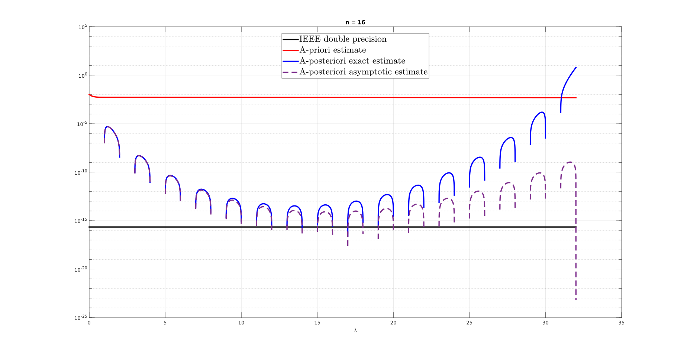
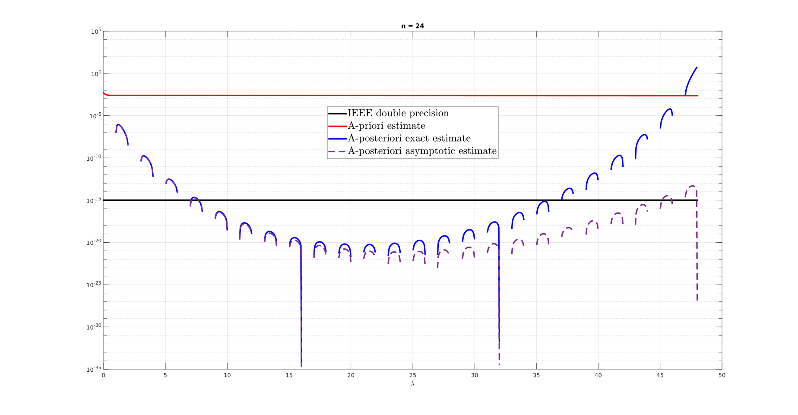

# NQL - Numerical Quadrature Library

This library implements in MATLAB an automatic numerical integration routine using __Newton-Cotes__ and __Gauss-Legendre__ formulae.

## Main structure
The library consists of
- [x] `simulation.m` is the interaction script from which the user sets the desired input parameters s.a.:
	* interval of integration _I = [a,b]_ specified through its endpoints _a,b_;
	* integrand, or target function f(x), specified as `kernel`;
	* number of discretisation nodes _N_ in _I_ for the numerical quadrature;
	* enable/disable optional features through global variables `print_flag` and `tabulated`; 
- [x] `main.m` computes the necessary parameters according to the choice of formulae provided by the user (nodes, affine map coefficients, jacobian etc...);
- [x] `legendre.m` if Gauss-Legendre formulae is selected it computes the nodes of the _N-th_ degree Legendre's polynomial while displaying the recursive polynomials used for its construction (optional) like so
	
- [x] `quadrature.m` defines the workflow for the computation of the weigths associated to the Lagrangian basis' functions;
- [x] `lagrangian_weights.m` computes the aforementioned weights;
- [x] `lagrange.m` computes iteratively the _NxN_ coefficient matrix associated to the _N_ Lagrange's polynomials of degree _N-1_ and plots them over the specified interval (optional) as shown
	
- [x] `extract_basis.m` for each node computes the coefficients of all monomials associated recursively to Lagrange's polynomial associated to that node;

## Options
- [x] `tabulated` The library can optionally choose to compute numerically the roots of the Legendre's polynomial via linear interpolation (set flag variable to 0) or to reference them from tabulated values with 289 decimal digits provided by [Pomax's repository](https://pomax.github.io/bezierinfo/legendre-gauss.html) (set flag to 1);
- [x] `print_flag` To realise the plot of Legendre's and Lagrange's polynomials depicted above set the flag value to 1 otherwise set it to 0. 

## Accessories
To support data management and visualisation the following functions have been provided:
- [x] `tab_legendre.m` contains tabulated values of the nodes of Legendre's ploynomial up to the 32nd degree;
- [x] `cmap.m` defines a colormap based on the interpolation of 8 colors and according to the number of Legendre's and Lagrange's functions are defined;
- [x] `doubledot.m` computes the inner product between two vectors but in ascending order of values so to avoid numerical cancellation;

## Suggested benchmarks
This suite was built for educational purposes and as a quick first reference for testing more performant softwares for numerical integration. The simulation can be launched through the script `simulation.m` or via the command window by passing the necessary input parameters to the function `main.m`.
The results displayed in Figure 2 from the paper [Design of quadrature rules for Müntz and Müntz-logarithmic polynomials using monomial transformation](https://onlinelibrary.wiley.com/doi/abs/10.1002/nme.2684) are replicated as benchmark for the library. The kernel is a sequence of Müntz monomials of the form
```matlab
kernel = @(x) x.^lambda;
```
where `lambda` is a real-valued exponent ranging continuosly from 0 to 48. With N=16 nodes of quadrature the various errors are



and with N=24 nodes of quadrature



where the _a-priori estimate_ is given as the L1-norm of the difference between the exact definite integral and NQL's output. The tests, ran both on a i5-1035G1 quad-core processor with 8 GB of RAM, took approximately 4 hours each to complete. The accuracy of the library is limited to `1e-4` by MATLAB's decimal digits truncation.